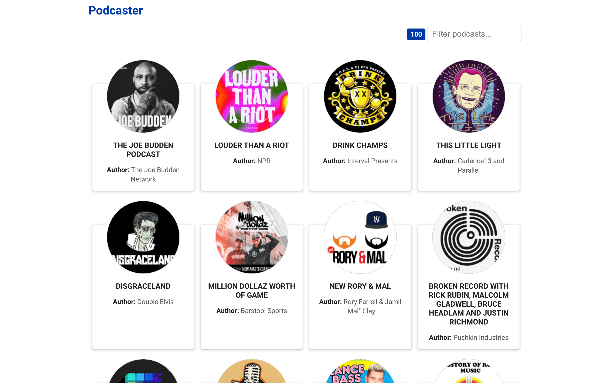
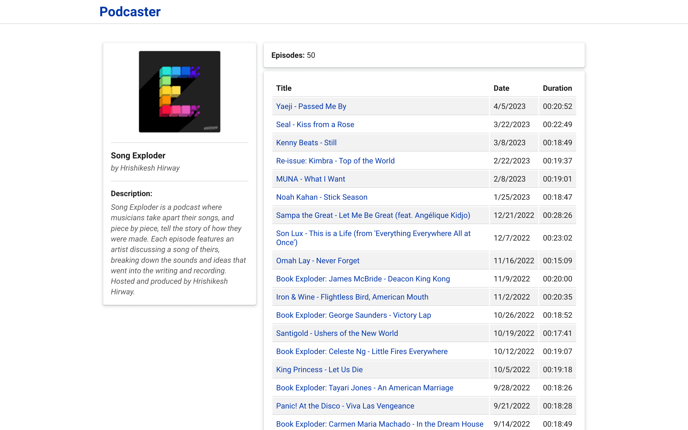
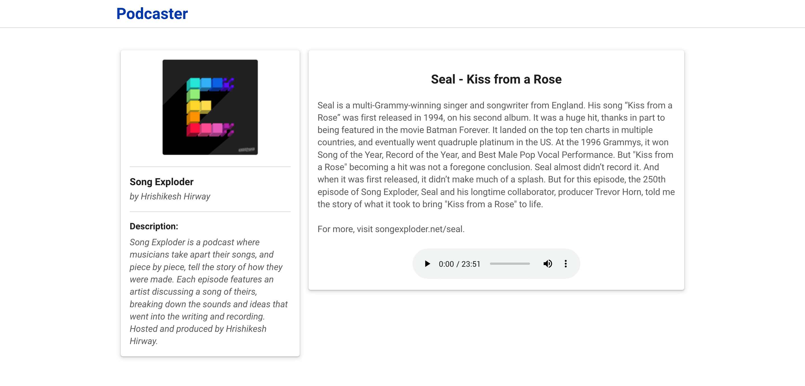

# Music Podcast

### Table of Contents
- [Description](#description)
- [Project structure](#project-structure)
- [How to run this app in local](#how-to-run-this-app-in-local)
- [How to build the app for production](#how-to-compile-and-build-the-app-for-production)
- [How to run the tests](#how-to-run-the-tests)
- [License](#license)

## Description
An application that shows the updated list of the 100 most popular podcasts according to the list of Apple.

### Podcasts main view
In this view, you'll be able to filter the podcasts by the title and the names of their authors.


When clicking on a podcast, you will navigate to the view with its details.

### Podcast details view
In this view, a sidebar is displayed with some details about the podcast, and in the main section, the total number of episodes is shown along with a list of them.


When clicking on the title of an episode, you will navigate to the view with its details.

### Podcast episode details view
In this view, the same sidebar with details about the podcast is displayed, and in the main section, the details of the selected episode are shown.


The sidebar always works as a link to the previous view, and the title of the app always works as a link to the main view.

## Project structure
```
/
├── public/
│   ├── index.html
│   ├── favicon.ico
│   ├── robots.txt
│   └── ...
├── src/
│   ├── components/
│   │   ├── Search/
│   │   │   ├── Search.tsx
│   │   │   └── __test__
│   │   │       └── Search.test.tsx
│   │   ├── PodcastsList/
│   │   │   └── PodcastsList.tsx
│   │   ├── EpisodesListCard/
│   │   │   └── ...
│   │   ├── PodcastDetailsCard/
│   │   │   └── ...
│   │   ├── EpisodeDetailsCard/
│   │   │   └── ...
│   │   └── ...
│   ├── contexts/
│   │   └-- appState.tsx
│   ├── hooks/
│   │   ├── useData.ts
│   │   └── useSearch.ts
│   ├── layouts/
│   │   ├── DetailsLayout.tsx
│   │   └── MainLayout.tsx
│   ├── pages/
│   │   ├── EpisodeDetails.tsx
│   │   ├── NotFound.tsx
│   │   ├-- PodcastDetails.tsx
│   │   └── PodcastMain.tsx
│   ├── types/
│   │   └── types.d.ts
│   ├── utils/
│   │   ├── api.ts
│   │   └── utils.ts
│   ├── App.scss
│   ├── App.tsx
│   ├── index.scss
│   ├── index.tsx
│   └── ...
├── package.json
├── tsconfig.json
└── ...
```

## Installation
* Clone: `git clone https://github.com/TBM85/demo-music-podcast`
* Enter in the directory: `cd demo-music-podcast`
* Install dependencies: `npm install`

## How to run this app in local
* Execute the following command in your terminal: `npm start`\
  Then, open [http://localhost:3000](http://localhost:3000) in your browser to view the running application.

## How to compile and build the app for production
* Execute the following command in your terminal: `npm run build`\
  This command will generate an optimized version of the application in the `build` folder. The application is ready to be deployed.

## How to run the tests
* Execute the following command in your terminal: `npm test`\
  This command will run all tests in the application and provide you with information on the results.

## License
Copyright (c) 2023 Tania Ballester. This project is using [MIT License](LICENSE.md)